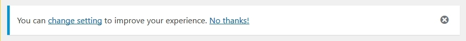
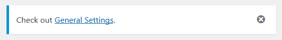

# Admin Notice Manager for Wordpress plugins

A utility class that allows easy setting and management of admin notices in Wordpress plugins.
Various types of admin notices are available, including dismissable one-off or persistent messages.
Graceful fallback for non-JS.

## Summary of notice types

Notices are either **one-off** or **persistent**:
* A one-off notice is dismissed automatically when a user sees it for the first time. The user will not see it again unless the notice is reset.
* A persistent notice is not dismissed automatically when a user sees it. It must either be dismissed by the user (if the notice is set
to be dismissable), or it must be dismissed programatically.

Notices are also either **added** or **opt out**:
* Added notices are stored in usermeta against the user(s) who should see them. When dismissed, the notice is removed from usermeta.
* Opt out notices are set to be displayed in the plugin code, and it is the dismissals (not the notices) that are stored in usermeta.

## Getting started

#### Download

Download the latest stable version from .

#### Installation

1. Copy the folder admin-notice-manager into the top-level folder of your plugin.
1. Open the file 'class-admin-notice-manager.php' and remame the class 'Plugin_Admin_Notice_Manager' by replacing 'Plugin' with your
plugin name or initials. So for example if your plugin is called 'Foo Bar', then you might rename the class to 'Foo_Bar_Admin_Notice_Manager'.
(This is what we'll use for the rest of the Readme examples - remember to replace Foo_Bar_ if you copy any of them.)
1. Include the file and initialize the class by putting this in your main plugin file, changing the 'manager_id', 'text_domain', and
'version' args to suit your plugin:

```php
require_once plugin_dir_path( dirname( __FILE__ ) ) . 'admin-notice-manager/class-admin-notice-manager.php';
Foo_Bar_Admin_Notice_Manager::init( array(
	'manager_id'	=>	'your_plugin_name_or_initials',		// Used as a prefix for keys when saving to usermeta.
	'text_domain'	=>	'your-plugin-text-domain',
	'version'		=>	'your plugin version e.g., 1.0.0'	// Used when enqueueing styles and script.
) );
```

If you want to put the admin-notice-manager folder in a sub-directory within your plugin folder (e.g., in an 'includes' folder),
you need to amend the path in the the `require_once` line of code accordingly.

#### Handling plugin uninstall

Assuming your plugin uses the  of the uninstall.php file,
then you should include the following code in that file (with Foo_Bar_ replaced accordingly):

```php
require_once dirname( __FILE__ ) . '/incl/admin-notice-manager/class-admin-notice-manager.php';
Foo_Bar_Admin_Notice_Manager::init( array(
	'manager_id'	=> 'your_plugin_name_or_initials'	// Change this to whatever you have set your manager id as.
) );
Foo_Bar_Admin_Notice_Manager::remove_all_data();
```

## Adding notices

#### Added notice

Use this code from anywhere in the plugin:
```php
Foo_Bar_Admin_Notice_Manager::add_notice( $args );
```

`$args` is an array defined with the following keys:
* **id** *string* Unique id for this notice. Default is hashed value of some of the notice parameters. Setting an id is _**strongly**_ recommended
however - otherwise non-unique ids are possible and may cause unexpected deletion of notices. Updating messages when they are changed by the
developer gets fiddly too.
* **message** *string* Message to be displayed.
* **wrap_tag** *string* Tag to wrap message in. Default is 'p'. Set to empty string or false for no wrap.
* **type** *string* One of 'success', 'error', warning', 'info'. Default is 'error'.
* **user_ids** *array* Array of user ids or user roles for whom message should be displayed. For example:
`array( 3, 'administrator', 55, 153, 'editors' )` will set the message for users with ids of 3, 55 and 153, and for all users that are
administrators or editors. Default is current user id.
* **screen_ids** *array|string* Array of screen ids on which message should be displayed. Set to empty array for all screens. If left unset
the current screen is set if possible, but it is recommended to specify the desired screen instead. If during testing the notice is
set on a screen that is then not viewed because of a redirect (e.g. options), changing the screen in the notice args will have no effect
because the notice has been stored in the db and will not be updated. Default is empty array (all screens ) for one-time messages,
and current screen for persistent.
* **post_ids** *array* Array of post ids on which message should be displayed. Empty array means all posts. Default is all posts.
* **persistent** *string* True for persistent, false for one-time. Default is false.
* **dismissable** *bool* Whether notice is dismissable. Default is true.
* **no_js_dismissable** *bool* Whether to give option to dismiss notice if no js. Only applies when `$dismissable` is true. Default is false. Caution
should be used in setting this to true. The act of dismissing the notice refreshes the screen so any changed data on screen will be lost. This could be
extremely frustrating for a user who has just entered or updated loads of data (e.g., when editing a post).
* **dismiss_all** *bool* Whether to delete notice for all users or just the user that has dismissed the notice. Only applies when `$dismissable`
is true. Default is false.

#### Opt out notices

You can use this code from anywhere in the plugin:

```php
Foo_Bar_Admin_Notice_Manager::add_opt_out_notice( $args );
```

`$args` is an array with the same keys as for added notices, with the following exceptions:
* **user_ids** An empty array means all users (instead of no users). Default is all users (not current user).
* **screen_ids** Default is all screens (not current screen).
* **dismiss_all** Forced to always be false. For dismiss_all effect, make sure that notice is not set in the first place (e.g., by setting a value
in options table).

It's probably a good idea to hook the addition of opt out notices to the `admin_init` hook so the plugin doesn't need check whether to display
the notice on the front end. Something like this:

```php
function foo_bar_add_opt_out_notices() {
	Foo_Bar_Admin_Notice_Manager::add_opt_out_notice( $args_for_a_notice );
	Foo_Bar_Admin_Notice_Manager::add_opt_out_notice( $args_for_another_notice );
}
add_action( 'admin_init', 'foo_bar_add_opt_out_notices' );
```

## Examples

**Error message on failed validation of a custom field for a post**

When validating the custom field data, the code below could be used to add a one-time message for the current user which would only be displayed
on the current screen.

```php
if ( $something_wrong ) {
	$args = array(
		'id'		=>	'some_setting_error',
		'message'	=>	__( 'You entered an invalid value.', 'plugin-text-domain' )
	);
	Foo_Bar_Admin_Notice_Manager::add_notice( $args );
}
```

This notice is added to usermeta for the current user and then removed again as soon as it is viewed.

**Dismissable persistent guidance for plugin users**

Lets' say you have a plugin that's added some feature to the edit post screen and you want users to remain informed of that until
they dismiss the notice. The feature is only available to administrators and editors, say. You could do something like this.

```php
function foo_bar_add_opt_out_notices() {
	$args = array(
		'id'			=>	'edit_post_guidance',
		'message'		=>	__( 'Check out the new whizzy feature for doing xyz...', 'plugin-text-domain' ),
		'screen_ids'	=>	array( 'post' ),					// Only show on the Edit post and Add New Post screens.
		'persistent'	=>	true,								// Make this a persistent message (it's also dismissable by default).
		'user_ids'		=>	array( 'administrator', 'editor' ),	// Only show this message to users who have administrator or editor role.
		'type'			=>	'info'								// Make this an info type message (the blue bar).
	);
	Foo_Bar_Admin_Notice_Manager::add_opt_out_notice( $args );
}
add_action( 'admin_init', 'foo_bar_add_opt_out_notices' );
```

## Actions on notice dismissal

**General dismissal**

The action `{$manager_id}_user_notice_dismissed_{$notice_id}` is fired whenever a notice is dismissed (whether added or opt out).
`$manager_id` is the id you set for the admin notice manager on initialization, and `$notice_id` is the id of the notice that has been dismissed.
The user id of the dismissing user is passed as an argument to the hooked function.

So to do something when the notice with id `edit_post_guidance` is dismissed, you can do something like this:

```php
function foo_bar_on_dismiss_guidance( $user_id ) {
	// Do something
}
add_action( 'foo_bar_user_notice_dismissed_edit_post_guidance', 'foo_bar_on_dismiss_guidance' );
```

**Specific dismissal**

You can use the class method `dismiss_event_button( $args )` to create a button for inclusion in your notice.
(This is in addition to the usual dismiss icon to the right of the notice.) When clicked, the notice is dismissed
and a specific event is fired.

`$args` is an array with the following keys:
* **content** *string* Html to display as button / link content.
* **event** *string* String to identify dismiss event. The action triggered will be `{$manager_id}_user_notice_dismissed_{$notice_id}_{$event}`
and the dismissing user id is passed as an argument to the action. Leave unset for no specific action to be fired.
* **classes** *array* Array of classes for the button. Default is `array( 'anm-link' )` which styles as a link.

So for example, you might want to suggest to administrators that they would like to change a setting for your plugin. You could do it like so:

```php
function foo_bar_add_opt_out_notices() {
	$change_setting_link = Foo_Bar_Admin_Notice_Manager::dismiss_event_button( array(
		'content'	=>	__( 'change setting', 'plugin-text-domain' ),
		'event'		=>	'change_some_setting'
	) );
	$no_change_link = Foo_Bar_Admin_Notice_Manager::dismiss_event_button( array(
		'content'	=>	__( 'No thanks!', 'plugin-text-domain' ),
		'event'		=>	''
	) );
	$args = array(
		'id'			=>	'settings_guidance',
		'message'		=>	sprintf( __( 'You can %1$s to improve your experience. %2$s', 'plugin-text-domain' ), $change_setting_link, $no_change_link ),
		'screen_ids'	=>	array( 'post' ),			// Only show on the Edit post and Add New Post screens
		'persistent'	=>	true,						// Make this a persistent message (it's also dismissable by default)
		'user_ids'		=>	array( 'administrator' ),	// Only show this message to users who have administrator or editor role
		'type'			=>	'info'						// Make this an info type message (the blue bar).
	);
	Foo_Bar_Admin_Notice_Manager::add_opt_out_notice( $args );
}
add_action( 'admin_init', 'foo_bar_add_opt_out_notices' );

function foo_bar_change_setting( $user_id ) {
	// Change the setting
}
add_action( 'foo_bar_user_notice_dismissed_settings_guidance_change_some_setting', 'foo_bar_change_setting' );
```

That creates a notice like this:



When a user clicks on the 'No thanks!' link or the dismiss icon, the notice is just dismissed. If user clicks on 'change setting', the notice
is dismissed and the action is fired.

**Redirect**

You may want a notice that suggests going to another location. You can use the function `dismiss_on_redirect_link( $args )` to create a link
in the notice that dismisses the notice on redirect.

`$args` is an array with the following keys:
* **content** *string* Html to display as link.
* **event** *string* Redirect url. Set as empty string for no redirect. Default is no redirect.
* **classes** *array* Array of classes for the button. Default is `array( 'anm-link' )` which styles as a link.

For example:

```php
function foo_bar_add_opt_out_notices() {
	$redirect_link = Foo_Bar_Admin_Notice_Manager::dismiss_on_redirect_link( array(
		'content'	=>	__( 'General Settings', 'plugin-text-domain' ),
		'redirect'	=>	admin_url( 'options-general.php' )
	) );
	$args = array(
		'id'			=>	'settings_redirect',
		'message'		=>	sprintf( __( 'Check out %s.', 'plugin-text-domain' ), $redirect_link ),
		'screen_ids'	=>	array( 'post' ),			// Only show on the Edit post and Add New Post screens
		'persistent'	=>	true,						// Make this a persistent message (it's also dismissable by default)
		'user_ids'		=>	array( 'administrator' ),	// Only show this message to users who have administrator or editor role
		'type'			=>	'info'						// Make this an info type message (the blue bar).
	);
	Foo_Bar_Admin_Notice_Manager::add_opt_out_notice( $args );
}
add_action( 'admin_init', 'foo_bar_add_opt_out_notices' );
```

That creates a notice like this:



## Other (potentially) useful methods

The class also has the following methods which may be useful ( for more info see the comments against the method in the class file):
* `add_opt_out_notices( array $notices )` Allows several opt out notices to be added in one go.
* `amend_added_notice( $old_notice_id, $new_notice )` Used to amend a notice that may have been added to users. This could be useful
in a scenario where the plugin has been live and some users may have notices stored against them in `usermeta`. However, the plugin
developer now wishes to change the notice in some way in a new release, perhaps changing the message or its id for example.
The developer changes the args in `Foo_Bar_Admin_Notice_Manager::add_notice( $args );`, but this won't change the notices that have
already been set in `usermeta` in the database. In this case, `amend_added_notice( $old_notice_id, $new_notice )` can be used in a function
that is called on plugin upgrade (for example).
* `amend_opt_out_dismissal_notice_id( $old_notice_id, $new_notice_id )` Similar to the previous method, this can be used when an opt out
notice id is updated and there may be dismissals stored in the database. Since only the notice id is stored for opt notices, there is no
need to update anything else in the database.
* `delete_added_user_notice( $notice_id, $user_id, $event, $prevent_action )` To delete a specific added notice from a given user.
* `delete_added_notice_from_all_users( $notice_id )` To delete a specific added notice from all users.
* `delete_added_user_notices( $user_id )` To remove all added notices from a given user.
* `remove_all_added_notices()` To remove all added notices from all users.
* `remove_opt_out_dismissals( $user_id, array $notice_ids )` To remove specific opt out dismissals from a user or all users.
* `remove_all_opt_out_dismissals( $user_id )` To remove all opt out dismissals from a user or all users.

## Contact

If you have any questions or suggestions, you can either [file an issue](https://github.com/jlad26/admin-notice-manager/issues)
or you can contact me . I'll do my best to get back to you!

## Licence

[GPL-2.0+](http://www.gnu.org/licenses/gpl-2.0.txt)